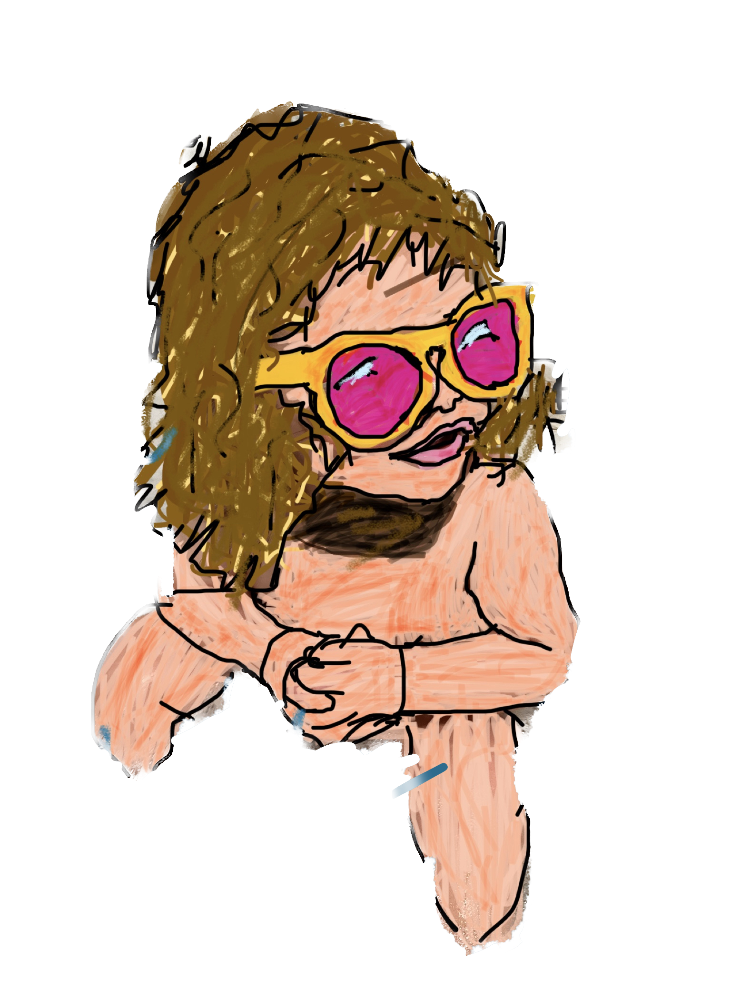

# ***[Blackjack](https://jpaulsisson-blackjack.netlify.app/)***

When my friend Daniel said he was asked to build a Blackjack game as part of an interview, I had to know if I was good enough to do that too.

---

***Guess what***...

***

I wasn't. At least not at first. He did it in less than 4 hours. It took me a lot longer but holy crap it was worth it.  
A challenge for sure, but the first time I made a bet and lost all my money because this game worked perfectly, hooooooo buddy, the rush of accomplishment was like drugs. Or what I imagine drugs is like. I wouldn't know.  

  

### Great for practicing:  

---

---

### Here's a cool pic I drew of my son:
unrelated to project, but he's so cute with that Elton John look

