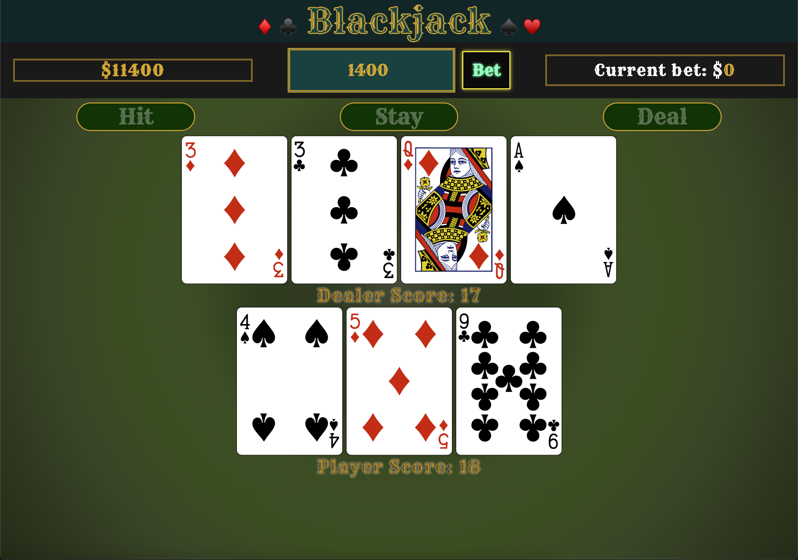

# ***[Blackjack](https://jpaulsisson-blackjack.netlify.app/)***

### Preview

### Things I learned:
  - Forms/Inputs/Submit
  - Making API calls with `fetch`
  - Working with `JSON` data
  - Dynamic rendering based on condition
  - JS built-ins:
    - `reduce`
    - `switch`
    - `shift`
    - `push`
  - React hooks `useEffect` and `useState`
  - CSS `grid` and `flexbox`
  - How to use CSS `clamp` on fonts properly <----game changer
  - How to manipulate the ` background ` property in CSS
  - How to deploy with Netlify

---

### Challenges I faced while building this:
  1. The conditional value of the ace (1 or 11) and how it related to counting the score automatically.
  2. Understanding useEffect and how it should be used/not used.
  3. The back face of the dealer card. The API didn't offer the back of a card so I had to make it with ` linear-gradient ` and ` background-repeat `
  4. Working with image sizes
  5. Auto-disabling the buttons at the correct times
  6. Writing the CSS to be fully responsive at all screen sizes

---

### Tech I used:  

---

### Things I'm proud of:
* **I DID IT!!!!**
* I took to the API calling like a duck to water.
* Didn't let my imposter syndrome win.
* Figuring out the algorithms to make it go.
* Getting it deployed
  
